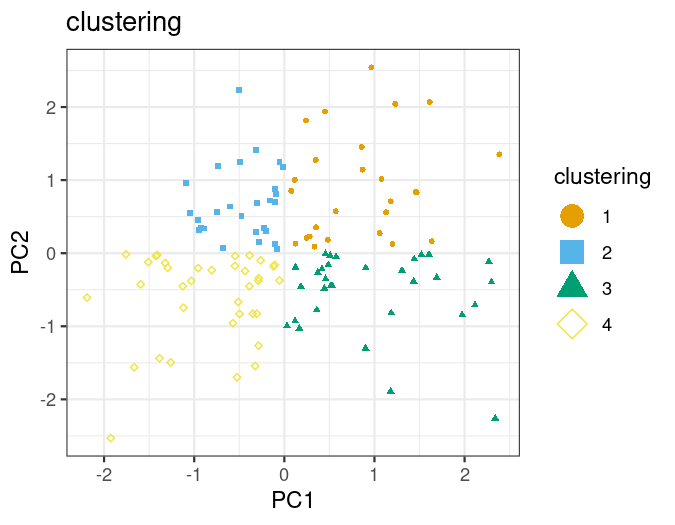
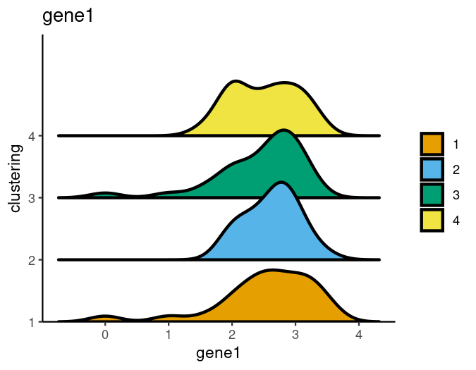
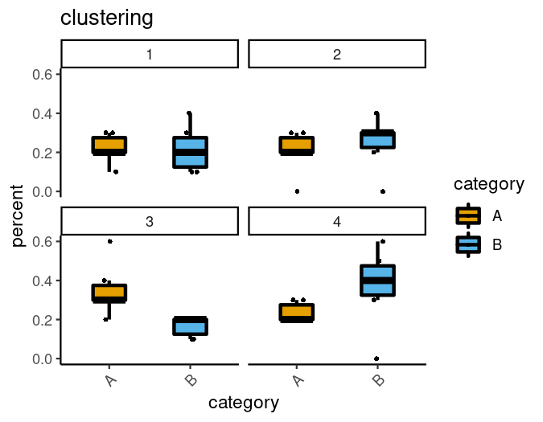
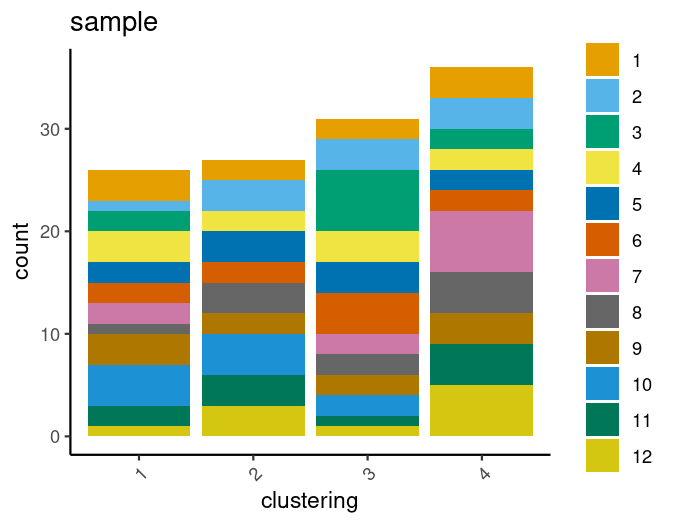
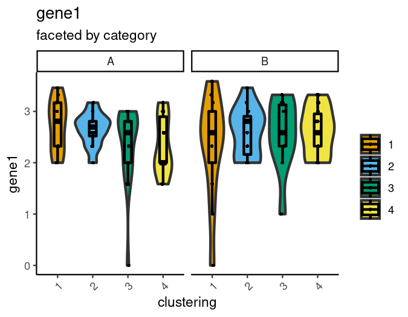
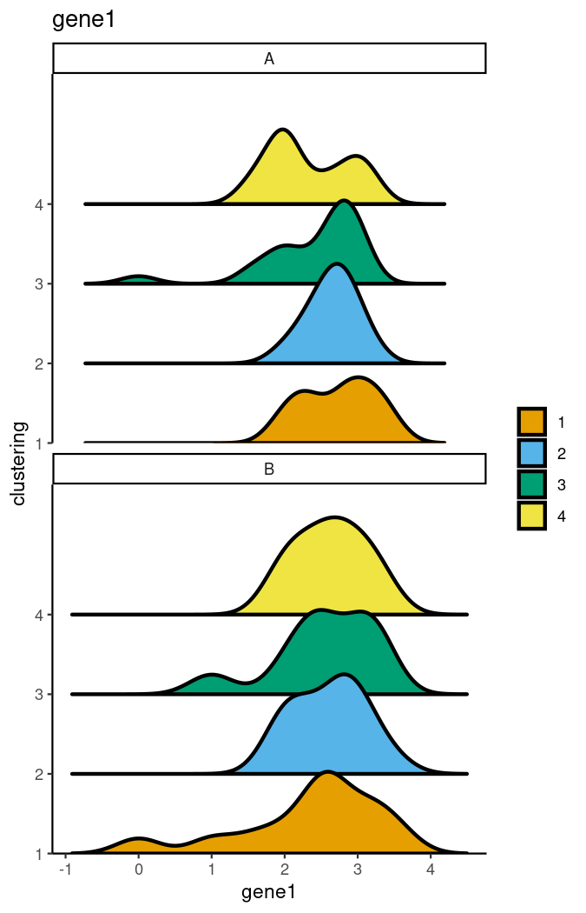

-   [Introduction](#introduction)
    -   [Color-blindness friendliness:](#color-blindness-friendliness)
-   [Installation](#installation)
-   [Getting started](#getting-started)
    -   [Input Data](#input-data)
-   [Visualizations](#visualizations)
    -   [scatterPlot](#scatterplot)
        -   [Additional features](#additional-features)
    -   [yPlot (+ ridgePlot, ridgeJitter, boxPlot
        wrappers)](#yplot-ridgeplot-ridgejitter-boxplot-wrappers)
        -   [Adjustments to data
            representations](#adjustments-to-data-representations)
    -   [barPlot & freqPlot](#barplot-freqplot)
    -   [scatterHex](#scatterhex)
        -   [Summary methods](#summary-methods)
        -   [Additional features](#additional-features-1)
-   [Customization via Simple Inputs](#customization-via-simple-inputs)
    -   [Subsetting to certain observations /
        rows](#subsetting-to-certain-observations-rows)
    -   [Faceting with split.by](#faceting-with-split.by)
    -   [All titles are adjustable.](#all-titles-are-adjustable.)
    -   [Colors can be adjusted
        easily.](#colors-can-be-adjusted-easily.)
    -   [Underlying data can be
        output.](#underlying-data-can-be-output.)
    -   [plotly hovering can be added.](#plotly-hovering-can-be-added.)
    -   [Rasterization / flattening to
        pixels](#rasterization-flattening-to-pixels)
-   [The ‘colLevels()’ Helper Function](#the-collevels-helper-function)
-   [Session information](#session-information)
-   [References](#references)

# Introduction

dittoViz is a tool built to make analysis and visualization of data
easier, faster, and more accessible. All included visualizations were
built with color-vision impaired users and viewers in mind. Thus, it
provides functions for jump-starting many useful visualization types,
which all utilize red-green color-blindness optimized colors by default,
and which allow sufficient customization, via discrete inputs, for
out-of-the-box creation of publication-ready figures.

The intention is for dittoViz to be a generalized version of the popular
yet scRNAseq focused dittoSeq package. Although we have started with
simply pulling the plotting features out of all dittoSeq’s
visualizations, the goal is to include many more plot types and to grow
dittoViz into a comprehensive, data-type agnostic visualization suite.
If there is a plot type missing that you would like to suggest be added,
please do so by [creating an
issue](https://github.com/dtm2451/dittoViz/issues/new) on the github!

## Color-blindness friendliness:

The default colors of this package are red-green color-blindness
friendly. To make it so, I used the suggested colors from (Wong 2011)
and adapted them slightly by appending darker and lighter versions to
create a 24 color vector. All plotting functions use these colors,
stored in `dittoColors()`, by default.

Additionally:

-   Shapes displayed in the legends are generally enlarged as this can
    be almost as helpful as the actual color choice for colorblind
    individuals.
-   When sensible, dittoViz functions have a shape.by input for having
    groups displayed through shapes in addition to color. (But note:
    even as a red-green color impaired individual myself writing this
    vignette, I often still recommend using color and generally use
    shapes as either a duplication of the color-data or for showing
    additional groupings.)
-   scatterPlots can be generated with letters overlaid (set do.letter =
    TRUE)

# Installation

dittoViz will eventually be available through Bioconductor. This section
will be updated once that is the case.

For now, install from the GitHub:

    # Install remotes if needed
    if (!requireNamespace("remotes", quietly = TRUE))
        install.packages("remotes")

    # Install dittoViz
    remotes::install_github("dtm2451/dittoViz")

# Getting started

## Input Data

All dittoViz functions have a `data_frame` input which takes a
data.frame-like object with observations / individual data points in
rows, and features of those observations in columns.

To get started here, we’ll make use of the `?dittoExampleData`
documentation point which was created entirely in order to allow
single-line, fast, generation <!-- of an example `data_frame` input: -->

    library(dittoViz)
    example("dittoExampleData", echo = FALSE)

    head(example_df, 10)

    ##       conditions timepoint   SNP groups score    gene1    gene2    gene3
    ## obs1  condition1        d0  TRUE      A   0.5 3.000000 5.087463 2.321928
    ## obs2  condition1        d0  TRUE      D   1.0 2.807355 5.129283 1.584963
    ## obs3  condition1        d0  TRUE      A   1.5 2.321928 5.000000 2.000000
    ## obs4  condition1        d0  TRUE      D   2.0 2.000000 4.754888 2.807355
    ## obs5  condition1        d0  TRUE      A   2.5 2.584963 5.209453 2.807355
    ## obs6  condition1        d0  TRUE      C   3.0 2.321928 4.700440 2.807355
    ## obs7  condition1        d0  TRUE      B   3.5 3.321928 5.129283 2.584963
    ## obs8  condition1        d0 FALSE      C   4.0 2.807355 4.754888 3.169925
    ## obs9  condition1        d0 FALSE      A   4.5 2.584963 4.754888 2.321928
    ## obs10 condition1        d0 FALSE      B   5.0 3.000000 4.954196 2.807355
    ##          gene4    gene5         PC1         PC2 clustering sample category
    ## obs1  1.584963 4.000000 -0.20901087  1.26800983          2      1        A
    ## obs2  1.584963 4.087463  0.56330392 -0.98186673          3      1        A
    ## obs3  1.000000 4.523562 -1.17908089  0.02387495          2      1        A
    ## obs4  1.000000 4.000000  0.61785709 -0.51212766          3      1        A
    ## obs5  1.000000 4.321928 -0.68003457  0.48504937          2      1        A
    ## obs6  1.584963 3.807355 -0.17048243  0.55090637          2      1        A
    ## obs7  1.584963 4.247928 -0.11260561 -0.57608244          4      1        A
    ## obs8  1.000000 4.392317 -0.70172224  0.27195073          2      1        A
    ## obs9  1.584963 4.459432  0.09408513  0.60456118          1      1        A
    ## obs10 0.000000 4.000000  3.09990080  0.03297917          1      1        A
    ##       subcategory
    ## obs1            1
    ## obs2            1
    ## obs3            1
    ## obs4            1
    ## obs5            1
    ## obs6            1
    ## obs7            1
    ## obs8            1
    ## obs9            1
    ## obs10           1

    summary(example_df)

    ##       conditions  timepoint            SNP             groups         
    ##  condition1:60   Length:120         Mode :logical   Length:120        
    ##  condition2:60   Class :character   FALSE:64        Class :character  
    ##                  Mode  :character   TRUE :56        Mode  :character  
    ##                                                                       
    ##                                                                       
    ##                                                                       
    ##      score           gene1           gene2           gene3      
    ##  Min.   : 0.50   Min.   :0.000   Min.   :4.170   Min.   :0.000  
    ##  1st Qu.:15.38   1st Qu.:2.322   1st Qu.:4.755   1st Qu.:2.000  
    ##  Median :30.25   Median :2.585   Median :4.907   Median :2.322  
    ##  Mean   :30.25   Mean   :2.442   Mean   :4.913   Mean   :2.289  
    ##  3rd Qu.:45.12   3rd Qu.:2.807   3rd Qu.:5.087   3rd Qu.:2.807  
    ##  Max.   :60.00   Max.   :3.459   Max.   :5.392   Max.   :3.322  
    ##      gene4           gene5            PC1                PC2          
    ##  Min.   :0.000   Min.   :3.322   Min.   :-2.66486   Min.   :-2.49358  
    ##  1st Qu.:1.000   1st Qu.:3.907   1st Qu.:-0.45730   1st Qu.:-0.72710  
    ##  Median :1.585   Median :4.087   Median : 0.09616   Median :-0.05090  
    ##  Mean   :1.469   Mean   :4.123   Mean   : 0.14231   Mean   :-0.05283  
    ##  3rd Qu.:2.000   3rd Qu.:4.392   3rd Qu.: 0.62054   3rd Qu.: 0.56351  
    ##  Max.   :2.807   Max.   :4.807   Max.   : 3.09990   Max.   : 2.87039  
    ##   clustering            sample        category         subcategory       
    ##  Length:120         Min.   : 1.00   Length:120         Length:120        
    ##  Class :character   1st Qu.: 3.75   Class :character   Class :character  
    ##  Mode  :character   Median : 6.50   Mode  :character   Mode  :character  
    ##                     Mean   : 6.50                                        
    ##                     3rd Qu.: 9.25                                        
    ##                     Max.   :12.00

# Visualizations

There are many different types of dittoViz visualizations. Each has
intuitive defaults which allow creation of immediately usable plots.
Each also has many additional tweaks available through discrete inputs
that can help ensure you can create precisely-tuned,
deliberately-labeled, publication-quality plots directly
‘out-of-the-box’!

## scatterPlot

These show data points overlaid on a scatter plot, using two numeric
columns of the `data_frame` as the axes and optionally additional
columns for color, shape, faceting, or other features.

    # Simplest Form
    scatterPlot(
        data_frame = example_df,
        x.by = "PC1", y.by = "PC2"
    )

    # Additionally colored by a discrete or numeric feature 
    scatterPlot(
        data_frame = example_df,
        x.by = "PC1", y.by = "PC2",
        color.by = "clustering")

    scatterPlot(
        data_frame = example_df,
        x.by = "PC1", y.by = "PC2",
        color.by = "gene1")

    # Additionally shaped or faceted by a discrete feature 
    scatterPlot(
        data_frame = example_df,
        x.by = "PC1", y.by = "PC2",
        color.by = "clustering",
        shape.by = "clustering")

    scatterPlot(
        data_frame = example_df,
        x.by = "PC1", y.by = "PC2",
        color.by = "clustering",
        split.by = "conditions")

### Additional features

Various additional features can be overlaid on top of these plots.
Adding each is controlled by an input that starts with `add.` or `do.`
such as:

-   `do.label`
-   `do.ellipse`
-   `do.letter`
-   `do.contour`
-   `do.hover`
-   `add.trajectory.by.groups`
-   `add.trajectory.curves`

Additional inputs that apply to and adjust these features will then
start with the XXXX part that comes after `add.XXXX` or `do.XXXX`, as
exemplified below. (Tab-completion friendly!)

A few examples:

    # A bit noisy looking because we're adding a LOT of the extras here...
    scatterPlot(
        example_df, x.by = "PC1", y.by = "PC2", color.by = "clustering",
        
        do.label = TRUE,
        labels.repel = FALSE,
        
        do.ellipse = TRUE,
        
        do.contour = TRUE,
        contour.color = "gray90",
        
        add.trajectory.by.groups = list(
            c(1,2),
            c(1,4,3)),
        trajectory.group.by = "clustering")

## yPlot (+ ridgePlot, ridgeJitter, boxPlot wrappers)

This plotter displays **continuous** data on a continuous-axis, grouped
in the other axis by any discrete feature such as sample or condition.

Data can be represented with violin plots, box plots, jitter
representing individual data points, and/or ridge plots, and the `plots`
input controls which of these data representations are used. (The
function name can be a bit of a misnomer in that ridge plots will use
the x-axis for the continuous data, and the y-axis for your groupings.)

The `group.by` input controls how the data are grouped in the x-axis.

The optional `color.by` input controls the colors that fill in violin,
box, and ridge plots.

    yPlot(
        example_df, "gene1", group.by = "clustering"
    )

`yPlot()` is the main function, but `ridgePlot()`, `ridgeJitter()`, and
`boxPlot()` are wrappers which just adjust the default for the `plots`
input from c(“vlnplot”, “boxplot”, “jitter”) to c(“ridgeplot”),
c(“ridgeplot”, “jitter”), or c(“boxplot”,“jitter”), respectively.

    ridgePlot(example_df, "gene1", group.by = "clustering")

    ridgeJitter(example_df, "gene1", group.by = "clustering")

    boxPlot(example_df, "gene1", group.by = "clustering")

### Adjustments to data representations

Tweaks to the individual data representation types can be made with
discrete inputs, all of which start with the representation types’ name.
For example…

    yPlot(example_df, "gene1", group.by = "clustering",
        plots = c("vlnplot", "jitter", "boxplot"), # <- order matters
        
        # change the color and size of jitter points
        jitter.color = "blue", jitter.size = 0.5, jitter.width = 1,
        
        # change the outline color and width, and remove the fill of boxplots
        boxplot.color = "white", boxplot.width = 0.1,
        boxplot.fill = FALSE,
        
        # change how the violin plot widths are normalized across groups
        vlnplot.scaling = "count",
        # also add lines at specified quantiles
        vlnplot.quantiles = c(0.1, 0.9),
        
        # add a dotted line representing some important cutoff
        add.line = 0.9
        )

## barPlot & freqPlot

These functions quantify and display frequencies of values of a
**discrete** data per sample / clustering / some other discrete data.

For both, data can be represented as either percentages or counts, and
this is controlled by the `scale` input.

    # barPlot
    barPlot(example_df, var = "sample", group.by = "clustering")

    barPlot(example_df, var = "sample", group.by = "clustering",
        scale = "count")

freqPlot separates each ‘var’-value into its own facet, and thus puts
more emphasis on each individual element. An additional `sample.by`
input controls splitting of cells within `group.by`-groups into
individual samples.

    # freqPlot
    freqPlot(
        data_frame = example_df,
        var = "clustering",
        sample.by = "sample",
        group.by = "category")

## scatterHex

An alternative to scatterPlot where instead of plotting each data point
individually, observations are first binned into hexagonal regions, and
then a summary from all observations of each bin is plotted.

The plot type is most handy for very densely packed data, and allows
plotting 1) observation density alone via color, or 2) observation
density via opacity in addition to some other feature via color.

    # Simplest Form, Density by color
    scatterHex(
        data_frame = example_df,
        x.by = "PC1", y.by = "PC2"
    )

    # Colored instead via a discrete or numeric feature 
    scatterHex(
        data_frame = example_df,
        x.by = "PC1", y.by = "PC2",
        color.by = "clustering")

    scatterHex(
        data_frame = example_df,
        x.by = "PC1", y.by = "PC2",
        color.by = "gene1")

### Summary methods

One key point of control lies how the `color.by` data are summarized.
This is controlled with the `color.method` input. As we saw above, this
input defaults to the “max” or most common value for discrete
`color.by`-data, and to the median value for numeric `color.by` data.

For discrete `color.by` data, we also offer `color.method = "max.prop"`
for highlighting diversity among regions of the plot.

For continuous `color.by` data, any named function which inputs a vector
of numbers and outputs a single numberic value can be used. E.g. mean,
min, max, sum, or sd (standard deviation) might all be useful in a given
context.

    scatterHex(
        data_frame = example_df,
        x.by = "PC1", y.by = "PC2",
        color.by = "gene1",
        color.method = "sum")

### Additional features

All additional features of scatterPlot, that don’t rely on plotting of
all individual data points, are available here as well:

-   `do.label`
-   `do.ellipse`
-   `do.contour`
-   `do.hover`
-   `add.trajectory.by.groups`
-   `add.trajectory.curves`

A few examples:

    # A bit noisy looking because we're adding a LOT of the extras here...
    scatterHex(
        example_df, x.by = "PC1", y.by = "PC2", color.by = "clustering",
        
        do.label = TRUE,
        labels.repel = FALSE,
        
        do.ellipse = TRUE,
        
        do.contour = TRUE,
        contour.color = "gray90",
        
        add.trajectory.by.groups = list(
            c(1,2),
            c(1,4,3)),
        trajectory.group.by = "clustering")

# Customization via Simple Inputs

**Many adjustments can be made with simple additional inputs**. Here,
we’ll go through a few that are consistent across most dittoViz
functions, but there are many more. Be sure to check the function
documentation (e.g. `?scatterPlot`) to explore more! Often, there will
be a section towards the bottom of a function’s documentation dedicated
to its specific tweaks!

## Subsetting to certain observations / rows

The data shown in a given plot can be adjusted with the `rows.use`
input. This can be provided as either a list of rownames to include, as
an integer vector with the indices of which rows to keep, or as a
logical vector that states whether each row should be included.

    # Original
    barPlot(example_df, var = "sample", group.by = "clustering", scale = "count")

    # First 10 cells
    barPlot(example_df, var = "sample", group.by = "clustering", scale = "count",
        # String method
        rows.use = c("obs1", "obs2", "obs3", "obs4", "obs5")
        # Index method, which would achieve the same effect
        # rows.use = 1:5
        )

    # "1"-cluster only 
    barPlot(example_df, var = "sample", group.by = "clustering", scale = "count",
        # Logical method
        rows.use = example_df$clustering == 1)

## Faceting with split.by

Most dittoViz plot types can be faceted into separate plots based on the
values of 1 or 2 discrete columns with a `split.by` input.

    yPlot(example_df, "gene1", group.by = "clustering",
        split.by = "category",
        sub = "faceted by category")

    scatterPlot(example_df, x.by = "PC1", y.by = "PC2", color.by = "gene1", 
        split.by = c("category", "subcategory"),
        sub = "faceted by category and subcategory")

Extra control over how this is done can be achieved with the
`split.adjust` input. `split.adjust` allows inputs to be passed through
to the ggplot functions used for achieving the faceting.

    yPlot(example_df, "gene1", group.by = "clustering", split.by = "category",
        split.adjust = list(scales = "free_y"))

When splitting is by only one metadata, the shape of the facet grid can
be controlled with `split.ncol` and `split.nrow`.

    ridgePlot(example_df, "gene1", group.by = "clustering", split.by = "category",
        split.ncol = 1)

## All titles are adjustable.

Relevant inputs are generally `main`, `sub`, `xlab`, `ylab`, and
`legend.title`.

    barPlot(example_df, "sample", group.by = "clustering",
        main = "Encounters",
        sub = "By Type",
        xlab = NULL, # NULL = remove
        ylab = "Generation 1",
        legend.title = "Types",
        x.labels.rotate = FALSE)

## Colors can be adjusted easily.

Colors are normally set with `color.panel` or `max.color` and
`min.color`. When color.panel is used (discrete data), an additional
input called `colors` sets the order in which those are actually used to
make swapping around colors easy when nearby groups appear too similar
in scatter plots!

    # original - discrete
    scatterPlot(example_df, "PC1", "PC2", "clustering")

    # swapped colors
    scatterPlot(example_df, "PC1", "PC2", "clustering",
        colors = 4:1)

    # different colors
    scatterPlot(example_df, "PC1", "PC2", "clustering",
        color.panel = c("red", "orange", "purple", "yellow", "skyblue"))

    # original - continuous
    scatterPlot(example_df, "PC1", "PC2", "gene1")

    # different colors
    scatterPlot(example_df, "PC1", "PC2", "gene1",
        max.color = "red", min.color = "gray90")

## Underlying data can be output.

Simply add `data.out = TRUE` to any of the individual plotters and a
representation of the underlying data will be output.

    barPlot(example_df, "sample", group.by = "clustering",
        data.out = TRUE)

    ## $p

    ## 
    ## $data
    ##    label grouping count label.count.total.per.facet    percent
    ## 1      1        1     2                          29 0.06896552
    ## 2      2        1     4                          29 0.13793103
    ## 3      3        1     3                          29 0.10344828
    ## 4      4        1     3                          29 0.10344828
    ## 5      5        1     2                          29 0.06896552
    ## 6      6        1     2                          29 0.06896552
    ## 7      7        1     1                          29 0.03448276
    ## 8      8        1     1                          29 0.03448276
    ## 9      9        1     4                          29 0.13793103
    ## 10    10        1     1                          29 0.03448276
    ## 11    11        1     2                          29 0.06896552
    ## 12    12        1     4                          29 0.13793103
    ## 13     1        2     5                          28 0.17857143
    ## 14     2        2     2                          28 0.07142857
    ## 15     3        2     1                          28 0.03571429
    ## 16     4        2     2                          28 0.07142857
    ## 17     5        2     4                          28 0.14285714
    ## 18     6        2     3                          28 0.10714286
    ## 19     7        2     1                          28 0.03571429
    ## 20     8        2     2                          28 0.07142857
    ## 21     9        2     2                          28 0.07142857
    ## 22    10        2     2                          28 0.07142857
    ## 23    11        2     1                          28 0.03571429
    ## 24    12        2     3                          28 0.10714286
    ## 25     1        3     2                          38 0.05263158
    ## 26     2        3     2                          38 0.05263158
    ## 27     3        3     2                          38 0.05263158
    ## 28     4        3     2                          38 0.05263158
    ## 29     5        3     4                          38 0.10526316
    ## 30     6        3     3                          38 0.07894737
    ## 31     7        3     6                          38 0.15789474
    ## 32     8        3     4                          38 0.10526316
    ## 33     9        3     2                          38 0.05263158
    ## 34    10        3     3                          38 0.07894737
    ## 35    11        3     5                          38 0.13157895
    ## 36    12        3     3                          38 0.07894737
    ## 37     1        4     1                          25 0.04000000
    ## 38     2        4     2                          25 0.08000000
    ## 39     3        4     4                          25 0.16000000
    ## 40     4        4     3                          25 0.12000000
    ## 41     5        4     0                          25 0.00000000
    ## 42     6        4     2                          25 0.08000000
    ## 43     7        4     2                          25 0.08000000
    ## 44     8        4     3                          25 0.12000000
    ## 45     9        4     2                          25 0.08000000
    ## 46    10        4     4                          25 0.16000000
    ## 47    11        4     2                          25 0.08000000
    ## 48    12        4     0                          25 0.00000000

## plotly hovering can be added.

Many dittoViz functions can be supplied `do.hover = TRUE` to have them
convert the output into an interactive plotly object that will display
additional data about each data point when the user hovers their cursor
on top.

Generally, a second input, `hover.data`, is used for denoting what extra
data to display. This input takes in a vector of column names in the
order you wish for them to be displayed. However, when the types of
underlying data possible to be shown are constrained because the plot
pieces represent summary data (barPlot and freqPlot), the `hover.data`
input is not used.

    # These can be finicky to render in knitting, but still, example code:
    scatterPlot(example_df, "PC1", "PC2", "gene1",
        do.hover = TRUE,
        hover.data = c("gene1", "sample", "clustering", "timepoint"))
    barPlot(example_df, "sample", group.by = "clustering",
        do.hover = TRUE)

## Rasterization / flattening to pixels

Sometimes, datasets have so many data points that working with each one
rendered individually becomes prohibitively computationally intensive,
especially when opening them in a vector-based graphics editor, such as
Illustrator. In such instances, it can be helpful to have the per-point
graphics layers flattened to a pixel representation. Generally, dittoViz
offers this capability via `do.raster` and `raster.dpi` inputs.

    # Note: dpi gets re-set by the styling code of this vignette, so this is
    #   just a code example -- the rendered plot won't look quite as intended.
    scatterPlot(example_df, "PC1", "PC2", "gene1",
        do.raster = TRUE,
        raster.dpi = 300)

# The ‘colLevels()’ Helper Function

dittoViz includes one helper functions that make it easier to determine
the discrete values within a column of your data frame. There are base R
functions which can achieve the same purpose, but the utility of this
function is it works regardless of whether the target data is a
character, numeric, or factor type.

This functionality is useful for certain inputs, ex: `vars.use` of
`freqPlot()`, for determining the full option set which you might want
to pull only a few options from.

    # Tells the unique values of any discrete data column
    # The 'conditions' column is a factor, while 'clustering' is a character vector
    colLevels("conditions", example_df)

    ## [1] "condition1" "condition2"

    colLevels("clustering", example_df)

    ## [1] "1" "2" "3" "4"

There are 2 addition inputs for the function, `rows.use` & `used.only`:

You can use the function along with standard dittoViz `rows.use`
subsetting to see if any groupings are removed by the given subsetting.

    # We can use rows.use to achieve any subsetting prior to value/level summary.
    colLevels(
        "conditions", example_df,
        rows.use = example_df$conditions!='condition1'
    )

    ## [1] "condition2"

And if you wish to know the recorded levels of your data, regardless of
whether any data points exist for those levels, you can set `used.only`
to FALSE. `used.only` is TRUE by default.

    # Note: Set 'used.only' (default = TRUE) to FALSE to show unused levels
    #  of data that are already factors.  By default, only the used options
    #  of the data are given.
    colLevels("conditions", example_df,
        rows.use = example_df$conditions!="condition1"
    )

    ## [1] "condition2"

    colLevels("conditions", example_df,
        rows.use = example_df$conditions!="condition1",
        used.only = FALSE
    )

    ## [1] "condition1" "condition2"

# Session information

    sessionInfo()

    ## R version 4.3.2 (2023-10-31)
    ## Platform: x86_64-pc-linux-gnu (64-bit)
    ## Running under: Pop!_OS 22.04 LTS
    ## 
    ## Matrix products: default
    ## BLAS:   /usr/lib/x86_64-linux-gnu/blas/libblas.so.3.10.0 
    ## LAPACK: /usr/lib/x86_64-linux-gnu/lapack/liblapack.so.3.10.0
    ## 
    ## locale:
    ##  [1] LC_CTYPE=en_US.UTF-8       LC_NUMERIC=C              
    ##  [3] LC_TIME=en_US.UTF-8        LC_COLLATE=en_US.UTF-8    
    ##  [5] LC_MONETARY=en_US.UTF-8    LC_MESSAGES=en_US.UTF-8   
    ##  [7] LC_PAPER=en_US.UTF-8       LC_NAME=C                 
    ##  [9] LC_ADDRESS=C               LC_TELEPHONE=C            
    ## [11] LC_MEASUREMENT=en_US.UTF-8 LC_IDENTIFICATION=C       
    ## 
    ## time zone: America/New_York
    ## tzcode source: system (glibc)
    ## 
    ## attached base packages:
    ## [1] stats     graphics  grDevices utils     datasets  methods   base     
    ## 
    ## other attached packages:
    ## [1] dittoViz_0.99.0 ggplot2_3.3.6  
    ## 
    ## loaded via a namespace (and not attached):
    ##  [1] gtable_0.3.3            dplyr_1.1.2             compiler_4.3.2         
    ##  [4] highr_0.10              tidyselect_1.2.0        ggbeeswarm_0.7.2       
    ##  [7] scales_1.2.1            yaml_2.3.7              fastmap_1.1.1          
    ## [10] lattice_0.22-5          hexbin_1.28.3           R6_2.5.1               
    ## [13] labeling_0.4.2          generics_0.1.3          isoband_0.2.7          
    ## [16] knitr_1.43              Cairo_1.6-0             MASS_7.3-60            
    ## [19] tibble_3.2.1            munsell_0.5.0           pillar_1.9.0           
    ## [22] rlang_1.1.1             utf8_1.2.3              xfun_0.39              
    ## [25] cli_3.6.1               withr_2.5.0             magrittr_2.0.3         
    ## [28] digest_0.6.31           grid_4.3.2              rstudioapi_0.15.0      
    ## [31] cowplot_1.1.1           beeswarm_0.4.0          lifecycle_1.0.3        
    ## [34] vipor_0.4.5             ggrastr_1.0.2           vctrs_0.6.3            
    ## [37] evaluate_0.21           glue_1.6.2              farver_2.1.1           
    ## [40] fansi_1.0.4             colorspace_2.1-0        rmarkdown_2.22         
    ## [43] ggplot.multistats_1.0.0 tools_4.3.2             pkgconfig_2.0.3        
    ## [46] htmltools_0.5.5         ggridges_0.5.4

# References

Wong, Bang. 2011. “Points of View: Color Blindness.” *Nature Methods* 8
(6): 441–41. <https://doi.org/10.1038/nmeth.1618>.
